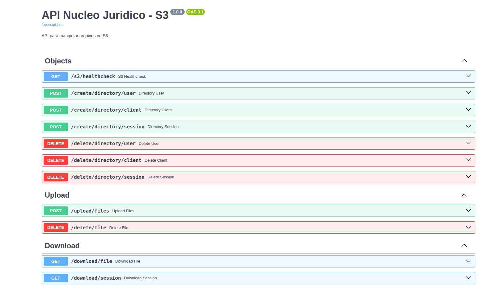

# 📁 Nucleo Jurídico - Upload de Documentos e OCR

---

---

## 🚀 Descrição

Sistema para processamento de documentos e imagens, com:

- Conversão de imagens para PDF com ajuste de contraste e redimensionamento para A4.  
- Upload automático de documentos e PDFs para **MinIO**.  
- Suporte a arquivos individuais e pastas mistas contendo imagens e documentos.  
- Download de arquivos de uma sessão , ou arquivos individuais 
- Estrutura organizada no bucket MinIO:

Ideal para digitalização de documentos de forma prática para professores e escritórios jurídicos.

---

## 🛠 Funcionalidades

- 📄 **Documentos suportados:** `.doc`, `.docx`, `.xls`, `.xlsx`, `.ppt`, `.pptx`, `.pdf`, `.txt`.  
- 🖼 **Imagens suportadas:** `.jpg`, `.jpeg`, `.png`, `.bmp`, `.tiff`.  
- ✅ **Upload seguro:** Todos os arquivos processados são enviados para MinIO.
- ✅ **Download** Faça download dos arquivos da sessão , ou apenas um arquivo
- ⚡ **Conversão automática:** Imagens → PDF com ajustes de contraste, escala de cinza e redimensionamento para A4.  

---

## 🌎 Como usar ? 
### Comandos 👨‍💻
- Crie o MinIO 
`docker compose up -d`

- Rodar a aplicação 
`uvicorn app.main:app --host 0.0.0.0 --port 8000 --reload --env-file .env --log-level info`
